## Overview

This project implements a cloud-based data warehousing solution using AWS services to ingest, transform, and visualize data. In this document, we will walk through the practical steps to set up and configure the data warehousing solution using AWS services.

## Architecture

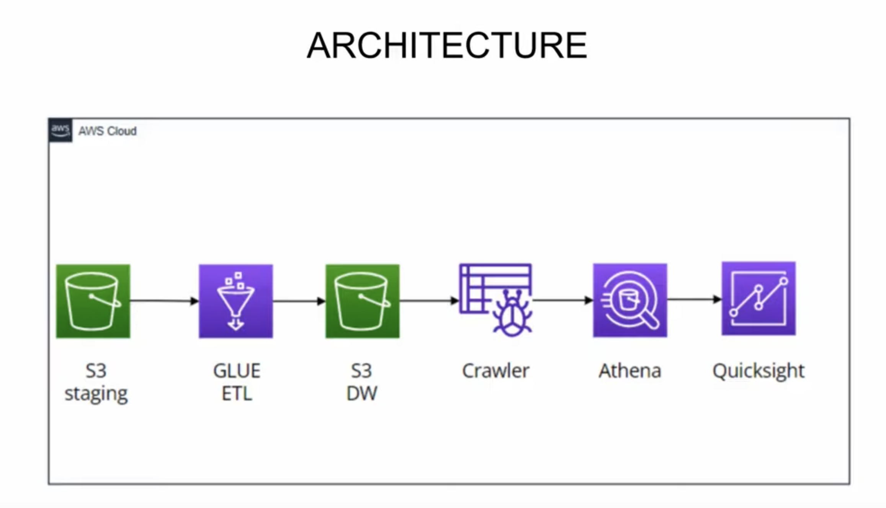

1. Create IAM roles and policies for access management.

- Go to Users > Create user
- Enter a username and select "Provide user access to AWS Management Console"
- Check users must create a new password at next sign-in

Click `next`

2. Attach policies

- AmazonS3FullAccess
- AWSGlueConsoleFullAccess
- AmazonAthenaFullAccess
- AmazonQuickSightFullAccess
- AWSQUIckSightDescribeRDS

Click `next`

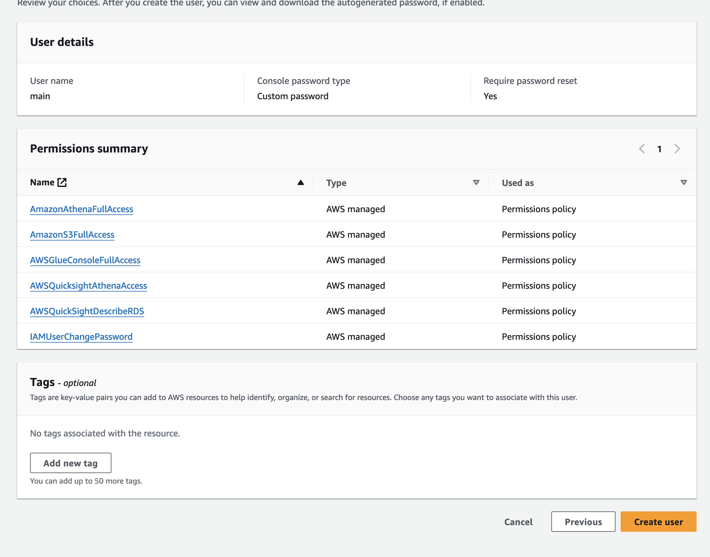
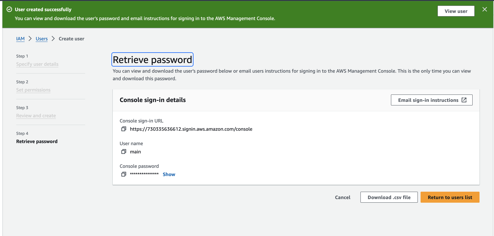

Follow the instuctions in the above image to login using the new user.

---

Now let us create staging bucket and create data lake bucket.

1. Login to the user we have just created.
   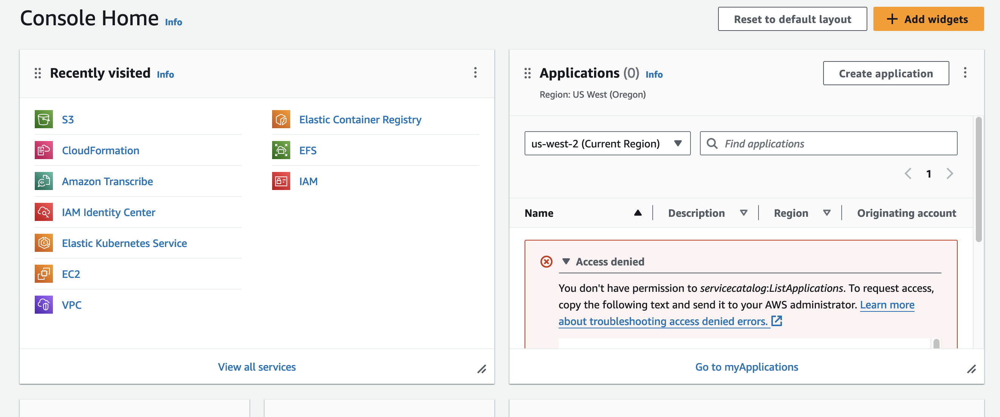

We create a new bucket for staging area and another for the data warehouse.
In simple terms, we will create folders in the bucket with the name `staging` and `data-warehouse`.

Click on services on left top corner and select storage > S3 > Create Bucket.

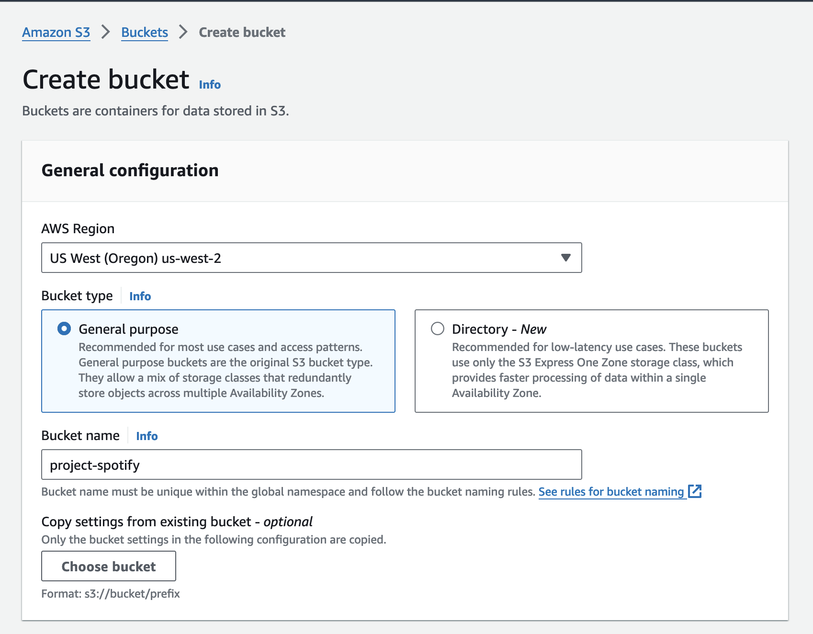

Now that it is created, let us create two folders in the bucket.

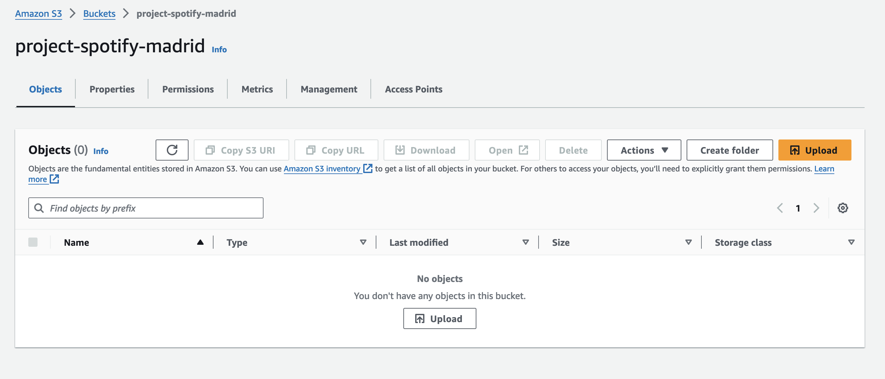
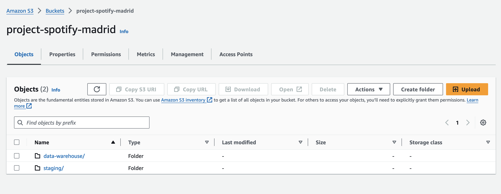

Upload the data in the staging area.
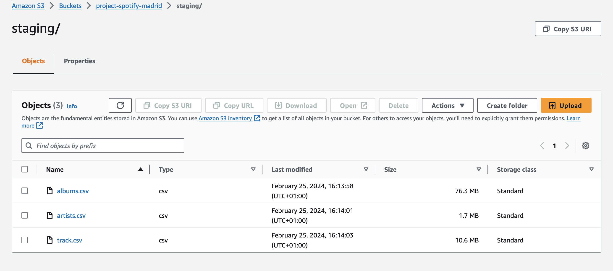

---

Now let us move to the next step, creating a data warehouse using AWS Glue.
We will create a visual ETL, run, and monitor the ETL job.

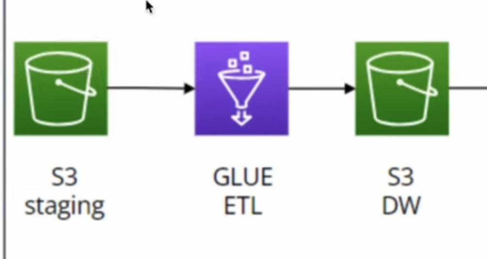

<!-- 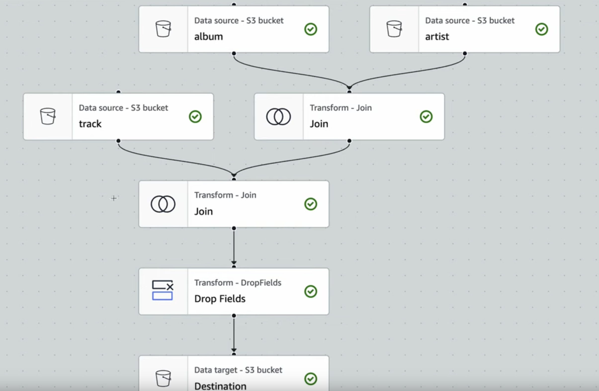 -->

In the AWS Glue console, we will create a reliable data pipeline to extract, transform, and load data from the staging area to the data warehouse. We will use the visual ETL tool to create a job, run the job, and monitor the job. But we can also notebooks or scripts to create the ETL job.

Visual ETL is a drag and drop tool to create ETL jobs. It will create a pyspark script in the backend.
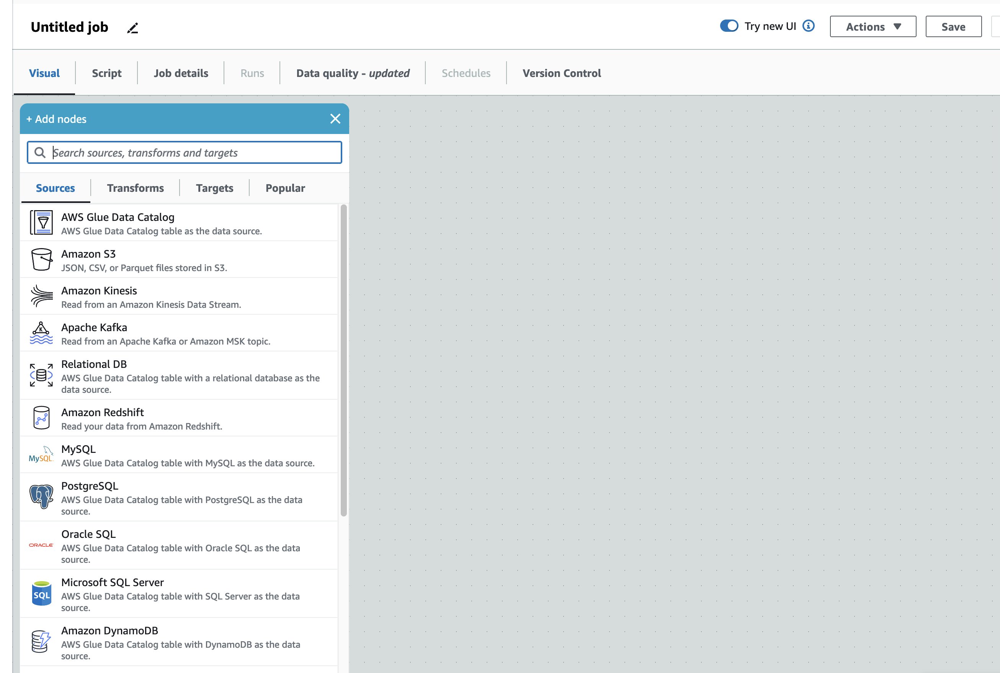

Let us then join albums and artists data and create a new table in the data warehouse.
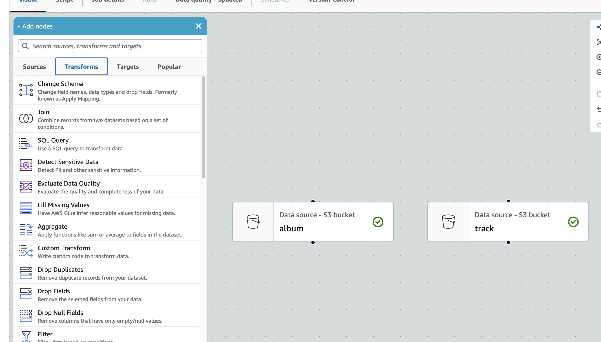

After the visual ETL is created, It looks like this:
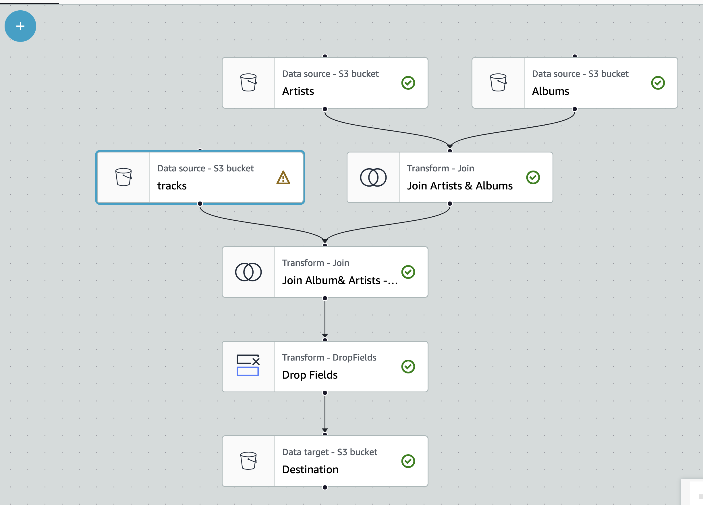

Its alternative pyspark script looks like this:
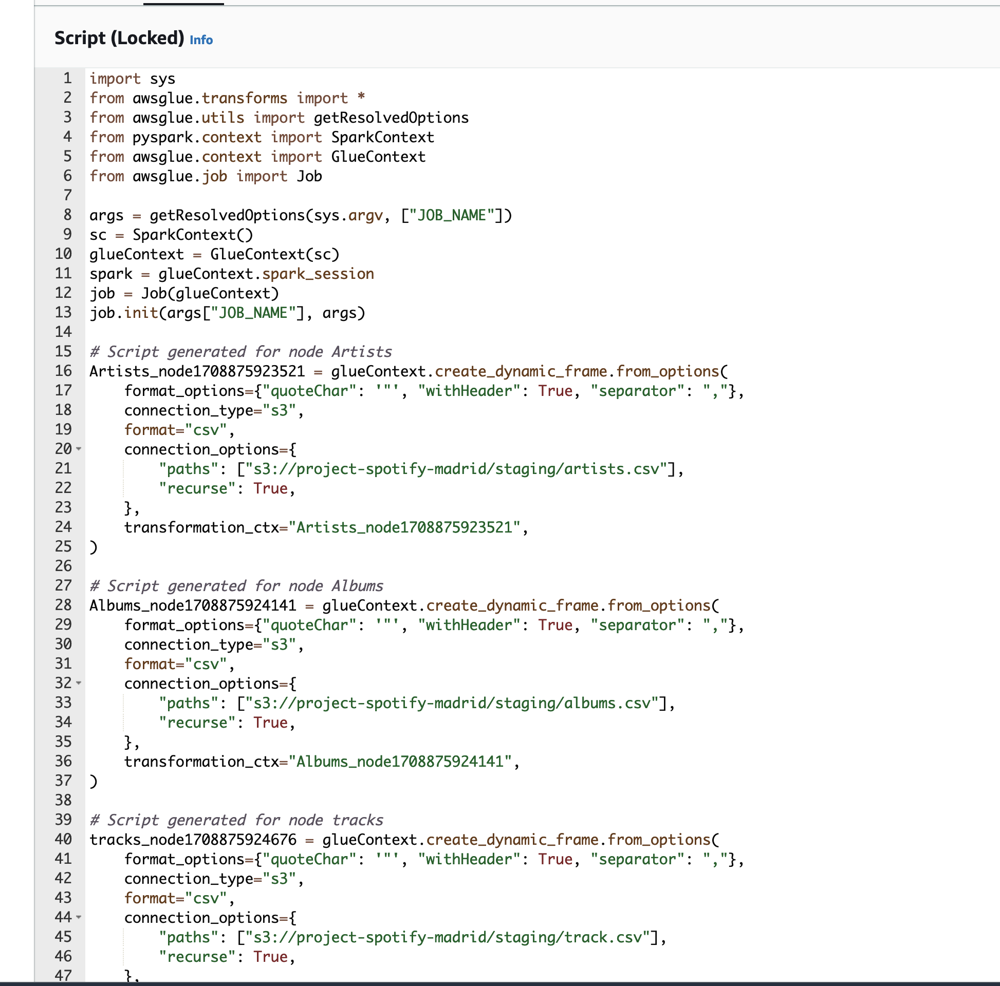

```python
import sys
from awsglue.transforms import *
from awsglue.utils import getResolvedOptions
from pyspark.context import SparkContext
from awsglue.context import GlueContext
from awsglue.job import Job

args = getResolvedOptions(sys.argv, ["JOB_NAME"])
sc = SparkContext()
glueContext = GlueContext(sc)
spark = glueContext.spark_session
job = Job(glueContext)
job.init(args["JOB_NAME"], args)

# Script generated for node Artists
Artists_node1708875923521 = glueContext.create_dynamic_frame.from_options(
    format_options={"quoteChar": '"', "withHeader": True, "separator": ","},
    connection_type="s3",
    format="csv",
    connection_options={
        "paths": ["s3://project-spotify-madrid/staging/artists.csv"],
        "recurse": True,
    },
    transformation_ctx="Artists_node1708875923521",
)

# Script generated for node Albums
Albums_node1708875924141 = glueContext.create_dynamic_frame.from_options(
    format_options={"quoteChar": '"', "withHeader": True, "separator": ","},
    connection_type="s3",
    format="csv",
    connection_options={
        "paths": ["s3://project-spotify-madrid/staging/albums.csv"],
        "recurse": True,
    },
    transformation_ctx="Albums_node1708875924141",
)

# Script generated for node tracks
tracks_node1708875924676 = glueContext.create_dynamic_frame.from_options(
    format_options={"quoteChar": '"', "withHeader": True, "separator": ","},
    connection_type="s3",
    format="csv",
    connection_options={
        "paths": ["s3://project-spotify-madrid/staging/track.csv"],
        "recurse": True,
    },
    transformation_ctx="tracks_node1708875924676",
)

# Script generated for node Join Artists & Albums
JoinArtistsAlbums_node1708875989145 = Join.apply(
    frame1=Artists_node1708875923521,
    frame2=Albums_node1708875924141,
    keys1=["id"],
    keys2=["artist_id"],
    transformation_ctx="JoinArtistsAlbums_node1708875989145",
)

# Script generated for node Join Album& Artists -- Tracks
JoinAlbumArtistsTracks_node1708876171118 = Join.apply(
    frame1=tracks_node1708875924676,
    frame2=JoinArtistsAlbums_node1708875989145,
    keys1=["track_id"],
    keys2=["track_id"],
    transformation_ctx="JoinAlbumArtistsTracks_node1708876171118",
)

# Script generated for node Drop Fields
DropFields_node1708876296701 = DropFields.apply(
    frame=JoinAlbumArtistsTracks_node1708876171118,
    paths=["`.track_id`", "id"],
    transformation_ctx="DropFields_node1708876296701",
)

# Script generated for node Destination
Destination_node1708876407455 = glueContext.write_dynamic_frame.from_options(
    frame=DropFields_node1708876296701,
    connection_type="s3",
    format="glueparquet",
    connection_options={
        "path": "s3://project-spotify-madrid/data-warehouse/",
        "partitionKeys": [],
    },
    format_options={"compression": "snappy"},
    transformation_ctx="Destination_node1708876407455",
)

job.commit()
```

After saving and running the job, we can monitor the job in the console.

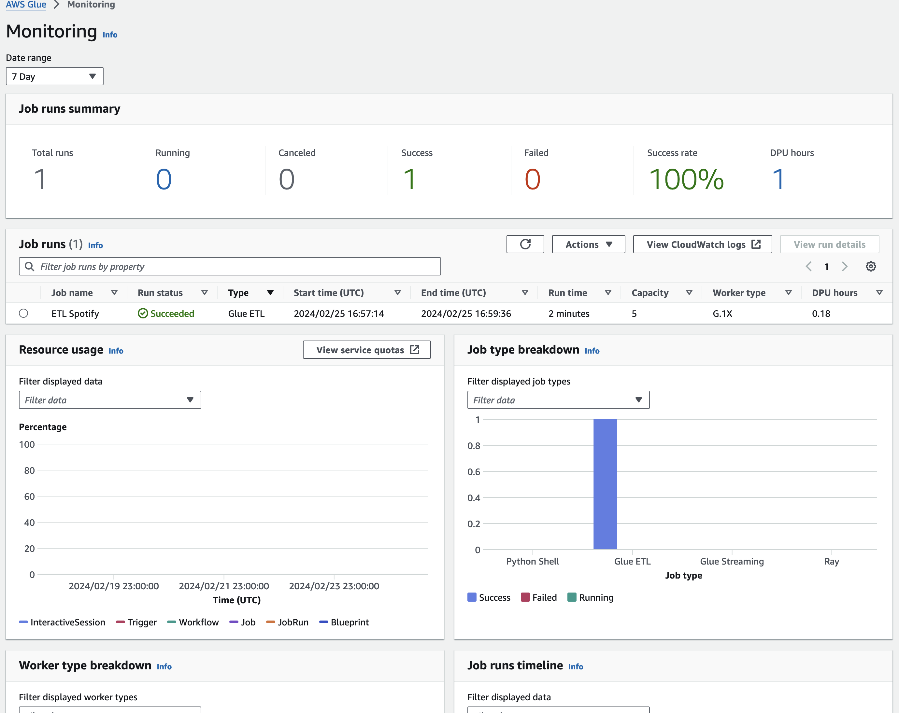
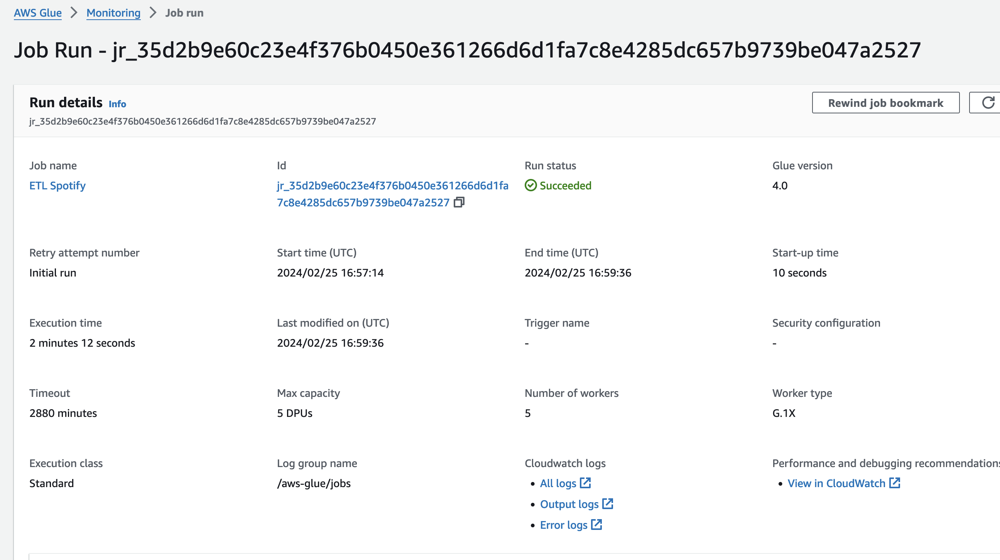

---

Next, we will run the crawler, create a data catalog and db

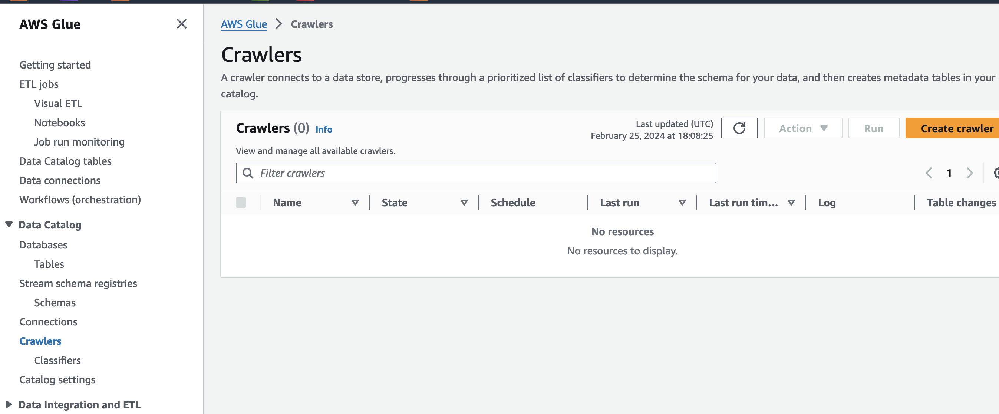
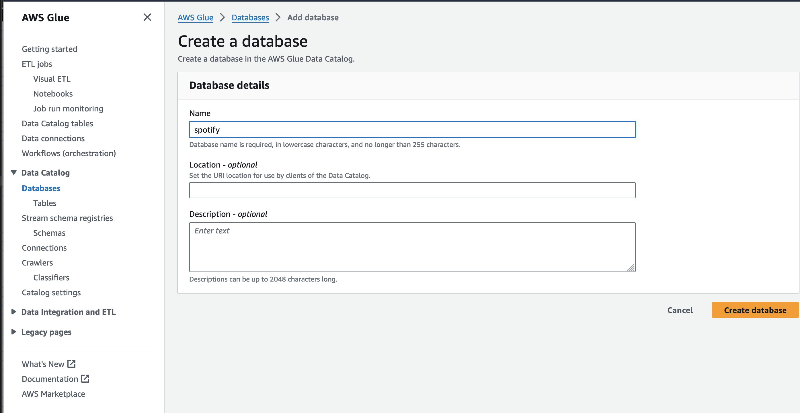

Run the crawler to populate the tables in database.

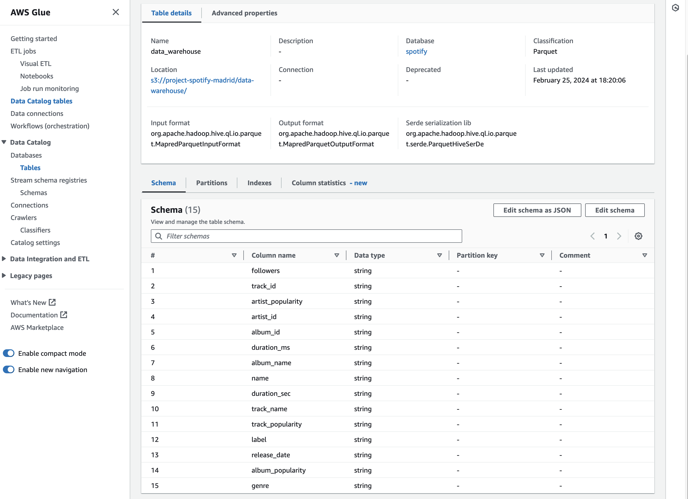

---

In this step, we are going to add athena, setup a query editor, and query the data using using athena

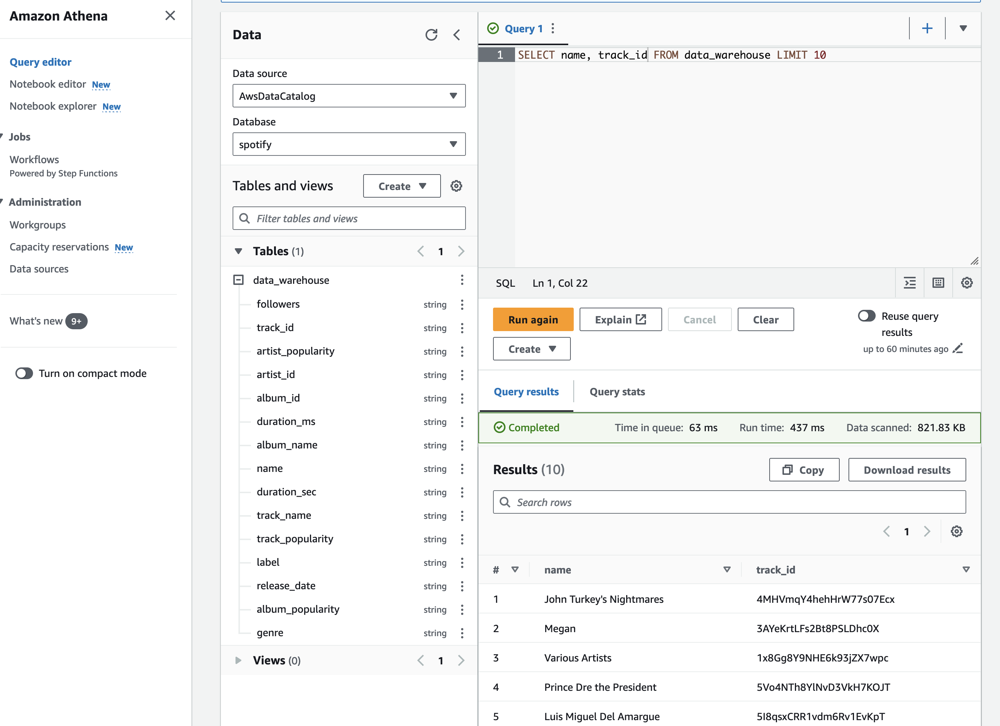

Before, we can run a query, we need to create a bucket that will store the query results.

The data is saved in the bucket as shown below:

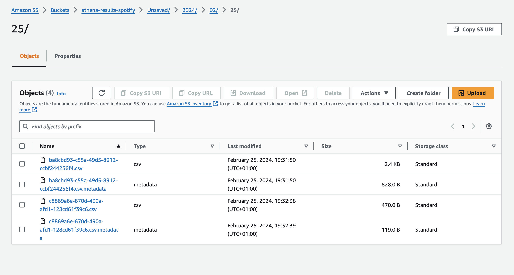

---

Finally, we will create a dashboard using QuickSight.

- Setup QuickSight
- Connect to the database
- Visualize the data

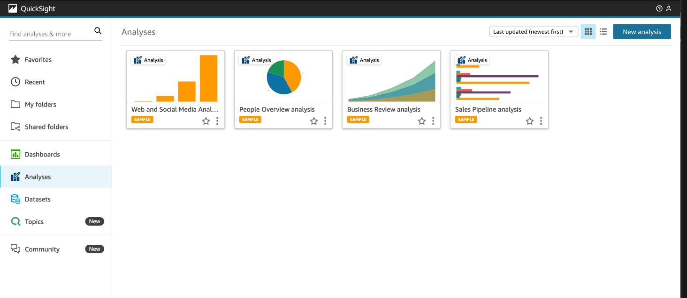

- Create a dataset
- Create a dashboard

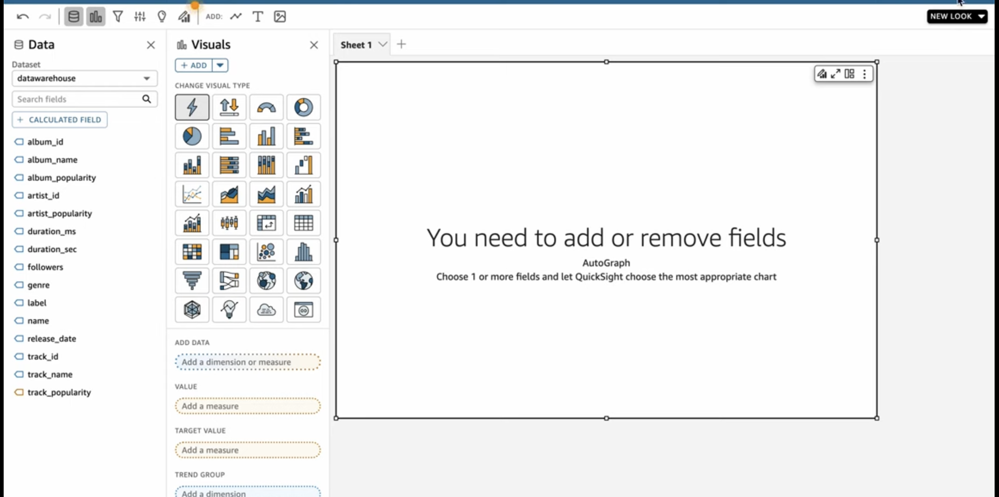

---

I have also set up a terraform script to automate the process of creating the resources in AWS [here](./setup.tf)

### Instructions:

1. **Customize Your Configuration:** Replace placeholder values such as `"my-aws-region"`, `"my-staging-bucket-name"`, `"my-data-warehouse-bucket-name"`, and the script location in the `aws_glue_job` resource with your actual data.
2. **Security and Permissions:** Adjust IAM policies and roles as necessary to align with your security requirements and AWS best practices.
3. **Execution:**
   - Initialize Terraform: Run `terraform init` to initialize the working directory.
   - Plan Your Deployment: Run `terraform plan` to see the changes that will be applied.
   - Apply Changes: Execute `terraform apply` to create the resources on AWS.

This script is a starting point. Depending on your project's specifics, such as additional AWS services or more granular IAM roles and policies, further customization might be needed.
